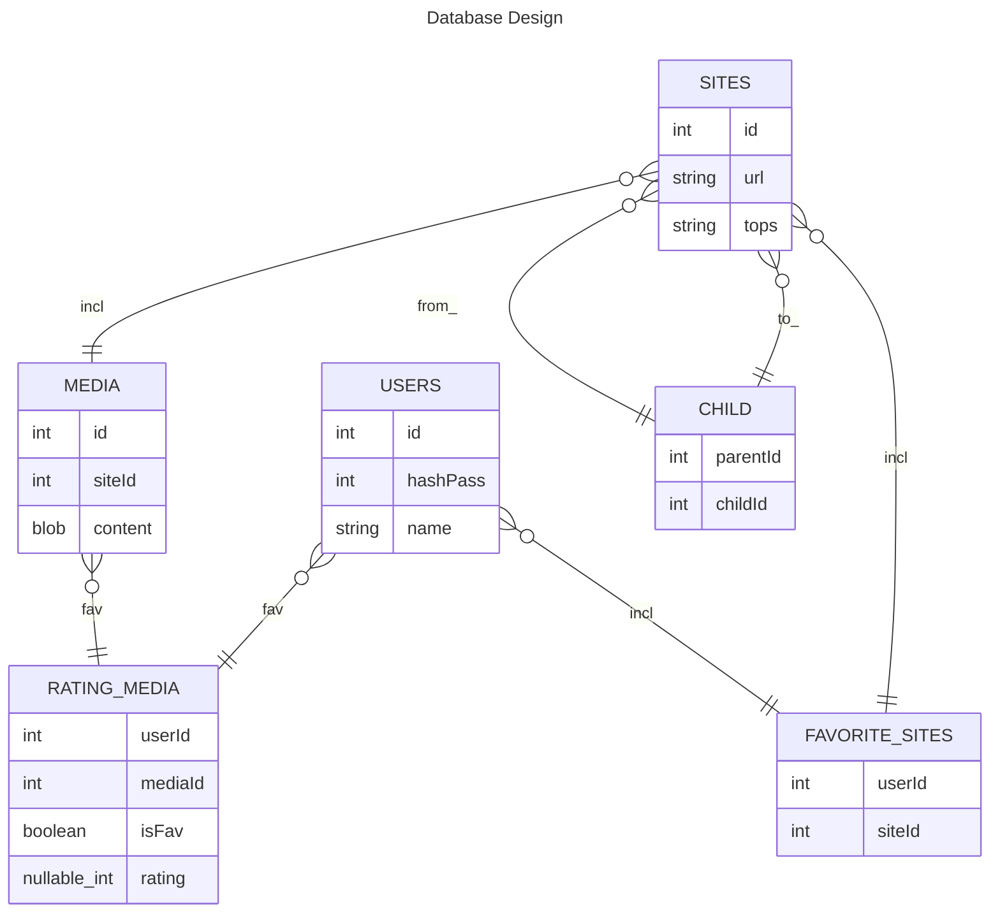

```mermaid
---
title: Database Design
---
erDiagram
    USERS {
        int id
        int hashPass
        string name
    }
    SITES {
        int id
        string url
        string tops
    }
    MEDIA {
        int id
        int siteId
        blob content
    }
    RATING_MEDIA {
        int userId
        int mediaId
        boolean isFav
        nullable_int rating
    }
    FAVORITE_SITES {
        int userId
        int siteId
    }
    CHILD {
        int parentId
        int childId
    }
    USERS }o--|| RATING_MEDIA : fav
    MEDIA }o--|| RATING_MEDIA : fav
    SITES }o--|| MEDIA : incl
    SITES }o--|| CHILD : to_
    SITES }o--|| CHILD : from_
    SITES }o--|| FAVORITE_SITES : incl
    USERS }o--|| FAVORITE_SITES : incl

```